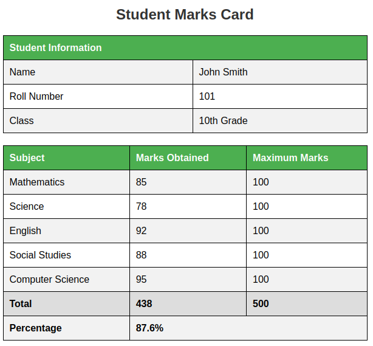

# CSE4001-Lab
Code for CSE4001 Lab record tasks

## Experiments

| Experiment | Work | Files | Result |
|------------|------|-------|--------|
| exp2 | IRCTC Form | irctc_improved.html |  |
| exp3 | Alphabet Chart | alphabet_chart.html |  |
| exp4 | Periodic Table | periodic-table.html, style.css |  |
| exp5 | Registration Form | registration.html |  |
| exp6 | Library Management | library-management.html |  |
| exp7 | Student Marks | student_marks.html |  |
