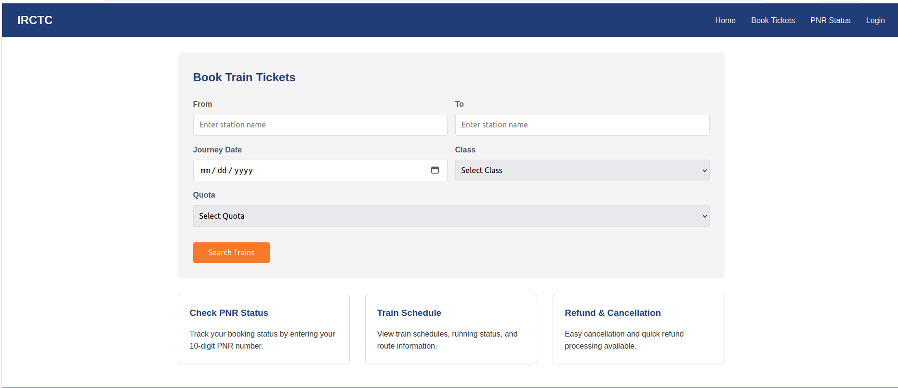

# Task: Create improved IRCTC website landing page

## Key improvements:
1. Modern HTML5 - Proper DOCTYPE and semantic elements
2. Semantic structure - header, nav, main, section, article, footer
3. Accessibility - ARIA labels, proper form labels, focus states
4. Responsive design - Mobile-friendly grid layout

## Result

